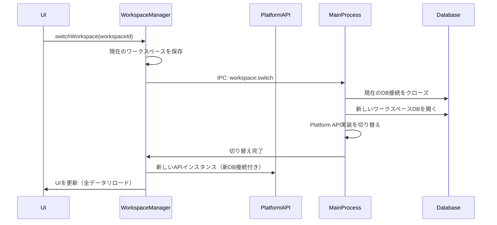

# チーム向け機能設計書

## 概要

現在のローカル動作のMCP Routerを、チーム向けに外部APIサーバーと接続できるよう拡張する。Chromeのプロファイル切り替えのように、ローカルセッションとリモートセッションを簡単に切り替えられるUIを提供する。

## アーキテクチャ

### ワークスペース管理

ワークスペースは、既存のデータを完全に分離するメタレベルのデータベースとして機能します。各ワークスペースは独立したデータベースを持ち、サーバー設定、エージェント、ログなどのデータが完全に分離されます。

#### ワークスペースタイプ

1. **ローカルワークスペース**
   - 独立したSQLiteデータベース（ワークスペースごとに別ファイル）
   - ローカルMCPサーバー管理
   - 完全にオフライン動作
2. **リモートワークスペース**
   - 外部APIエンドポイントに接続
   - チーム共有設定
   - 認証必須
   - ローカルキャッシュDB（オプション）

#### ワークスペースデータ構造

```typescript
interface Workspace {
  id: string;
  name: string;
  type: "local" | "remote";
  isActive: boolean;
  createdAt: Date;
  lastUsedAt: Date;

  // ローカルワークスペース用
  localConfig?: {
    databasePath: string; // workspace-specific DB path
  };

  // リモートワークスペース用
  remoteConfig?: {
    apiUrl: string;
    authToken?: string;
    teamId?: string;
    userId?: string;
  };

  // UI表示用
  displayInfo: {
    avatarUrl?: string;
    email?: string;
    teamName?: string;
  };
}

interface WorkspaceState {
  workspaces: Workspace[];
  activeWorkspaceId: string;
  isTransitioning: boolean;
}
```

### Platform API拡張

Platform APIは既にローカル/リモートの抽象化を提供しているため、ワークスペース切り替え時にPlatform APIの実装を動的に変更します。各ワークスペースは独自のデータベースインスタンスを持ちます。

```typescript
// ワークスペース管理インターフェース
interface WorkspaceManager {
  // ワークスペース操作
  listWorkspaces(): Promise<Workspace[]>;
  createWorkspace(config: WorkspaceCreateConfig): Promise<Workspace>;
  switchWorkspace(workspaceId: string): Promise<void>;
  deleteWorkspace(workspaceId: string): Promise<void>;
  updateWorkspace(
    workspaceId: string,
    updates: Partial<Workspace>,
  ): Promise<void>;

  // 現在のワークスペース
  getCurrentWorkspace(): Promise<Workspace>;

  // Platform API切り替え（ワークスペース固有のDBインスタンスを含む）
  getPlatformAPI(): PlatformAPI;
}

// ワークスペース作成設定
interface WorkspaceCreateConfig {
  name: string;
  type: "local" | "remote";
  remoteConfig?: {
    apiUrl: string;
    authMethod: "token" | "oauth";
    credentials?: any;
  };
}
```

### データ分離戦略

#### ワークスペースごとの完全なデータ分離

各ワークスペースは独立したデータベースを持ち、以下のデータが完全に分離されます：

- **サーバー設定** (`servers`テーブル)
- **エージェント** (`agents`テーブル)
- **ログ** (`logs`テーブル)
- **設定** (`settings`テーブル)
- **トークン** (`tokens`テーブル)

#### メタデータベース（ワークスペース管理用）

- **ワークスペースメタデータ**: `workspaces.db`（メインのメタDB）
- **認証情報**: `safeStorage.encryptString()`で暗号化
- **セッション分離**: `session.fromPartition()`でワークスペースごとに分離

#### ローカルワークスペース

- **データベースパス**: `userData/workspaces/{workspace-id}/database.db`
- **デフォルトワークスペース**: `local-default`
- 既存のテーブル構造を各ワークスペースDBに複製

#### リモートワークスペース

- **API通信**: 外部APIサーバーとの通信
- **ローカルキャッシュ**: `userData/workspaces/{workspace-id}/cache.db`（オプション）
- **認証トークン**: メタDBに暗号化して保存
- **セッションCookie**: ワークスペース専用パーティションで管理

### ワークスペース切り替えフロー



## UI/UX設計

### Titlebarの拡張

```
[Traffic Lights] [App Title]                    [Workspace Switcher ▼] [Window Controls]
                                                   ┌─────────────┐
                                                   │ 👤 Workspace│
                                                   └─────────────┘
```

#### ワークスペーススイッチャーコンポーネント

```typescript
interface WorkspaceSwitcherProps {
  currentWorkspace: Workspace;
  workspaces: Workspace[];
  onSwitch: (workspaceId: string) => void;
  onAddWorkspace: () => void;
  onManageWorkspaces: () => void;
}
```

#### ドロップダウンメニュー構造

```
┌─────────────────────────────┐
│ ✓ 個人用（ローカル）          │
│   開発環境（ローカル）        │
│   チーム A（リモート）        │
│   チーム B（リモート）        │
├─────────────────────────────┤
│ ＋ 新しいワークスペースを追加  │
│ ⚙️ ワークスペースを管理       │
└─────────────────────────────┘
```

### 新規ワークスペース追加ダイアログ

```
┌─────────────────────────────────────┐
│      新しいワークスペースを追加        │
├─────────────────────────────────────┤
│                                     │
│ ワークスペース名: [_______________]   │
│                                     │
│ タイプ:                             │
│ ○ ローカル（個人用）                 │
│ ● リモート（チーム用）               │
│                                     │
│ API URL: [___________________]      │
│                                     │
│ 認証方法:                           │
│ ○ APIトークン                      │
│ ○ OAuth (Google/GitHub)            │
│                                     │
│        [キャンセル] [作成]           │
└─────────────────────────────────────┘
```

## 実装アーキテクチャ（既存構造の拡張）

### ワークスペース管理サービスの実装

```typescript
// src/main/services/workspace-service.ts
import { BaseService } from "./base-service";
import { Singleton } from "../../lib/utils/backend/singleton";
import { SqliteManager } from "../../lib/database";
import { safeStorage, session, app } from "electron";
import path from "path";
import fs from "fs-extra";

export interface Workspace {
  id: string;
  name: string;
  type: "local" | "remote";
  isActive: boolean;
  createdAt: Date;
  lastUsedAt: Date;
  localConfig?: {
    databasePath: string;
  };
  remoteConfig?: {
    apiUrl: string;
    authToken?: string; // 暗号化して保存
    teamId?: string;
    userId?: string;
  };
  displayInfo?: {
    avatarUrl?: string;
    email?: string;
    teamName?: string;
  };
}

export class WorkspaceService
  extends BaseService<Workspace, string>
  implements Singleton<WorkspaceService>
{
  private static instance: WorkspaceService | null = null;
  private electronSessions: Map<string, Electron.Session> = new Map();
  private databaseInstances: Map<string, SqliteManager> = new Map();
  private metaDb: SqliteManager; // ワークスペースメタデータ用DB

  public static getInstance(): WorkspaceService {
    if (!WorkspaceService.instance) {
      WorkspaceService.instance = new WorkspaceService();
    }
    return WorkspaceService.instance;
  }

  private constructor() {
    super();
    this.initializeMetaDatabase();
  }

  private initializeMetaDatabase(): void {
    const metaDbPath = path.join(app.getPath("userData"), "workspaces.db");
    this.metaDb = new SqliteManager(metaDbPath);
    this.createMetaTables();
  }

  private createMetaTables(): void {
    this.metaDb.exec(`
      CREATE TABLE IF NOT EXISTS workspaces (
        id TEXT PRIMARY KEY,
        name TEXT NOT NULL,
        type TEXT NOT NULL CHECK(type IN ('local', 'remote')),
        isActive INTEGER NOT NULL DEFAULT 0,
        createdAt TEXT NOT NULL,
        lastUsedAt TEXT NOT NULL,
        localConfig TEXT, -- JSON
        remoteConfig TEXT, -- JSON
        displayInfo TEXT   -- JSON
      )
    `);
  }

  protected getEntityName(): string {
    return "ワークスペース";
  }

  // ワークスペース固有のデータベースを取得
  async getWorkspaceDatabase(workspaceId: string): Promise<SqliteManager> {
    if (!this.databaseInstances.has(workspaceId)) {
      const workspace = await this.findById(workspaceId);
      if (workspace.type === "local") {
        const dbPath =
          workspace.localConfig?.databasePath ||
          path.join(
            app.getPath("userData"),
            "workspaces",
            workspaceId,
            "database.db",
          );

        // ディレクトリが存在しない場合は作成
        await fs.ensureDir(path.dirname(dbPath));

        const db = new SqliteManager(dbPath);
        this.databaseInstances.set(workspaceId, db);
      }
    }
    return this.databaseInstances.get(workspaceId)!;
  }

  // 認証情報の暗号化保存
  async saveWorkspaceCredentials(
    workspaceId: string,
    token: string,
  ): Promise<void> {
    if (safeStorage.isEncryptionAvailable()) {
      const encrypted = safeStorage.encryptString(token);
      const encryptedBase64 = encrypted.toString("base64");

      // メタDBに保存
      this.metaDb
        .prepare(
          "UPDATE workspaces SET remoteConfig = json_set(remoteConfig, '$.authToken', ?) WHERE id = ?",
        )
        .run(encryptedBase64, workspaceId);
    }
  }

  // セッションの分離
  getIsolatedSession(workspaceId: string): Electron.Session {
    if (!this.electronSessions.has(workspaceId)) {
      const partition = `persist:workspace-${workspaceId}`;
      const isolatedSession = session.fromPartition(partition);
      this.electronSessions.set(workspaceId, isolatedSession);
    }
    return this.electronSessions.get(workspaceId)!;
  }

  // ワークスペース切り替え
  async switchWorkspace(workspaceId: string): Promise<void> {
    // 現在のDBをクローズ
    const currentWorkspace = await this.getActiveWorkspace();
    if (currentWorkspace && this.databaseInstances.has(currentWorkspace.id)) {
      const currentDb = this.databaseInstances.get(currentWorkspace.id);
      currentDb?.close();
      this.databaseInstances.delete(currentWorkspace.id);
    }

    // 新しいワークスペースをアクティブに
    this.metaDb.transaction(() => {
      this.metaDb.prepare("UPDATE workspaces SET isActive = 0").run();
      this.metaDb
        .prepare(
          "UPDATE workspaces SET isActive = 1, lastUsedAt = ? WHERE id = ?",
        )
        .run(new Date().toISOString(), workspaceId);
    })();

    // Platform APIの切り替えをトリガー
    this.emit("workspace-switched", workspaceId);
  }

  // アクティブワークスペースを取得
  async getActiveWorkspace(): Promise<Workspace | null> {
    const row = this.metaDb
      .prepare("SELECT * FROM workspaces WHERE isActive = 1")
      .get();
    return row ? this.deserializeWorkspace(row) : null;
  }

  private deserializeWorkspace(row: any): Workspace {
    return {
      ...row,
      localConfig: row.localConfig ? JSON.parse(row.localConfig) : undefined,
      remoteConfig: row.remoteConfig ? JSON.parse(row.remoteConfig) : undefined,
      displayInfo: row.displayInfo ? JSON.parse(row.displayInfo) : undefined,
      createdAt: new Date(row.createdAt),
      lastUsedAt: new Date(row.lastUsedAt),
    };
  }
}
```

### データベースアーキテクチャ

#### ディレクトリ構造

```
userData/
├── workspaces.db         # メタデータベース（ワークスペース一覧）
└── workspaces/
    ├── local-default/
    │   └── database.db   # デフォルトワークスペースのDB
    ├── workspace-abc123/
    │   └── database.db   # ワークスペースABC123のDB
    └── workspace-xyz789/
        ├── database.db   # ワークスペースXYZ789のDB
        └── cache.db      # リモートワークスペースのキャッシュ
```

#### 各ワークスペースDBの構造

各ワークスペースのdatabase.dbには、既存のすべてのテーブルが含まれます：

```sql
-- 各ワークスペースDBに含まれるテーブル
CREATE TABLE servers (...);
CREATE TABLE agents (...);
CREATE TABLE logs (...);
CREATE TABLE settings (...);
CREATE TABLE tokens (...);
```

### メタデータベース初期化

```sql
-- workspaces.dbの初期化
CREATE TABLE IF NOT EXISTS workspaces (
  id TEXT PRIMARY KEY,
  name TEXT NOT NULL,
  type TEXT NOT NULL CHECK(type IN ('local', 'remote')),
  isActive INTEGER NOT NULL DEFAULT 0,
  createdAt TEXT NOT NULL,
  lastUsedAt TEXT NOT NULL,
  localConfig TEXT, -- JSON: {"databasePath": "path/to/db"}
  remoteConfig TEXT, -- JSON: {"apiUrl": "...", "authToken": "..."}
  displayInfo TEXT   -- JSON: {"avatarUrl": "...", "email": "..."}
);

-- デフォルトのローカルワークスペース
INSERT OR IGNORE INTO workspaces (id, name, type, isActive, createdAt, lastUsedAt, localConfig)
VALUES (
  'local-default',
  'ローカル',
  'local',
  1,
  datetime('now'),
  datetime('now'),
  json('{"databasePath": "workspaces/local-default/database.db"}')
);
```

### IPC通信拡張

```typescript
// src/main/handlers/workspace-handlers.ts
export function registerWorkspaceHandlers() {
  // ワークスペース一覧取得
  ipcMain.handle("workspace:list", async () => {
    return getWorkspaceService().list();
  });

  // ワークスペース作成
  ipcMain.handle(
    "workspace:create",
    async (_, config: WorkspaceCreateConfig) => {
      return getWorkspaceService().create(config);
    },
  );

  // ワークスペース切り替え
  ipcMain.handle("workspace:switch", async (_, workspaceId: string) => {
    await getWorkspaceService().switchWorkspace(workspaceId);
    // Platform APIを再初期化
    await reinitializePlatformAPI(workspaceId);
  });

  // 現在のワークスペース取得
  ipcMain.handle("workspace:current", async () => {
    return getWorkspaceService().getActiveWorkspace();
  });
}
```

### Platform API切り替え実装

```typescript
// src/main/platform-api-manager.ts
import { SqliteManager } from "../lib/database";

class PlatformAPIManager {
  private currentAPI: PlatformAPI | null = null;
  private currentWorkspaceId: string | null = null;
  private currentDatabase: SqliteManager | null = null;

  async initialize(workspaceId: string): Promise<void> {
    const workspaceService = getWorkspaceService();
    const workspace = await workspaceService.findById(workspaceId);

    // 現在のDBをクローズ
    if (this.currentDatabase) {
      this.currentDatabase.close();
      this.currentDatabase = null;
    }

    if (workspace.type === "local") {
      // ワークスペース固有のDBを取得
      this.currentDatabase =
        await workspaceService.getWorkspaceDatabase(workspaceId);

      // 既存のローカル実装を使用（ワークスペース固有のDBを渡す）
      this.currentAPI = createLocalPlatformAPI(this.currentDatabase);
    } else {
      // リモートAPI実装を使用
      this.currentAPI = createRemotePlatformAPI(workspace.remoteConfig);

      // キャッシュDBが必要な場合
      if (workspace.remoteConfig?.enableCache) {
        const cacheDbPath = path.join(
          app.getPath("userData"),
          "workspaces",
          workspaceId,
          "cache.db",
        );
        this.currentDatabase = new SqliteManager(cacheDbPath);
      }
    }

    this.currentWorkspaceId = workspaceId;
  }

  getCurrentAPI(): PlatformAPI {
    if (!this.currentAPI) {
      throw new Error("Platform API not initialized");
    }
    return this.currentAPI;
  }

  getCurrentDatabase(): SqliteManager | null {
    return this.currentDatabase;
  }
}
```

## 実装フェーズ

### Phase 1: 基盤構築（1週間）

1. WorkspaceService/Repositoryの実装
2. データベースマイグレーション追加
3. IPC通信ハンドラーの実装
4. Platform API切り替え機構の実装

### Phase 2: UI実装（1週間）

1. Titlebarコンポーネントの拡張
2. セッションスイッチャーUI
3. 新規セッション追加ダイアログ
4. セッション管理画面

### Phase 3: Platform API統合（1週間）

1. セッションベースのPlatform API切り替え
2. リモートAPI実装の作成
3. 認証フローの実装
4. エラーハンドリング

### Phase 4: データ管理（3-4日）

1. セッションごとのデータ分離
2. キャッシュ戦略の実装
3. オフライン対応
4. データ同期機能

### Phase 5: テストと最適化（3-4日）

1. 統合テスト
2. パフォーマンス最適化
3. エラーハンドリング強化
4. ドキュメント作成

## セキュリティ考慮事項

1. **認証情報の保護**
   - `safeStorage.encryptString()` / `safeStorage.decryptString()`使用
   - macOS: Keychain、Windows: DPAPI、Linux: libsecret統合
   - メモリ上での認証情報の最小化
2. **セッション分離**
   - `session.fromPartition()`でセッションごとにCookie、キャッシュ、認証を分離
   - webContentsのセッション隔離
   - セッション間のデータ漏洩防止
3. **通信セキュリティ**
   - HTTPS必須
   - 証明書検証（`app.on('certificate-error')`でのハンドリング）
   - CSPヘッダーの適切な設定
4. **ローカルデータ保護**
   - electron-storeの暗号化オプション使用
   - アプリケーションサンドボックス内でのデータ保存
   - 適切なファイルパーミッション設定

## 技術的制約と解決策

### 制約

1. Electron単一プロセスでの複数データベース管理
2. メモリ使用量の増加（複数ワークスペースのDB接続）
3. ワークスペース切り替え時のレイテンシ
4. データベースファイルの整合性管理

### 解決策

1. ワークスペースごとの独立したSQLiteファイル
2. 非アクティブワークスペースのDB接続を自動クローズ
3. メタデータベースでの軽量な管理とオンデマンドDB接続
4. ワークスペース切り替え時の適切なトランザクション管理

## 将来の拡張性

1. **マルチウィンドウ対応**
   - ワークスペースごとの独立ウィンドウ
   - 複数ワークスペースの同時利用
2. **データ移行機能**
   - ワークスペース間でのデータエクスポート/インポート
   - ローカル↔リモート間の設定同期
3. **権限管理**
   - チーム内での役割ベースアクセス制御
   - ワークスペースレベルの権限設定
4. **監査ログ**
   - ワークスペース活動の記録
   - データベース変更履歴の追跡
